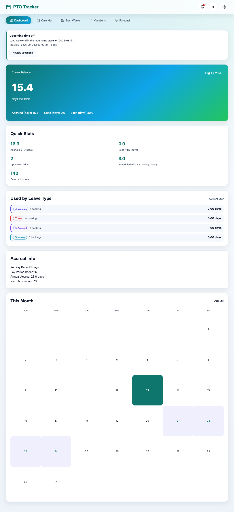
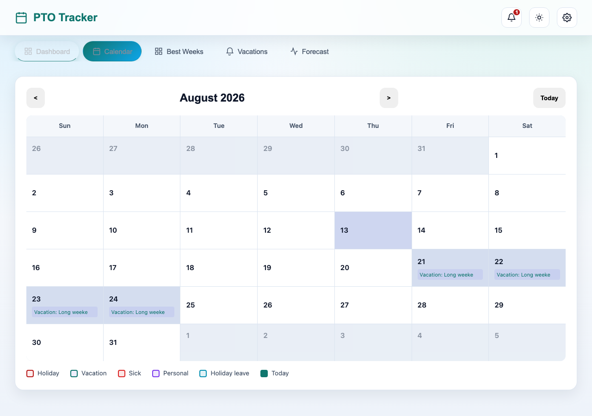
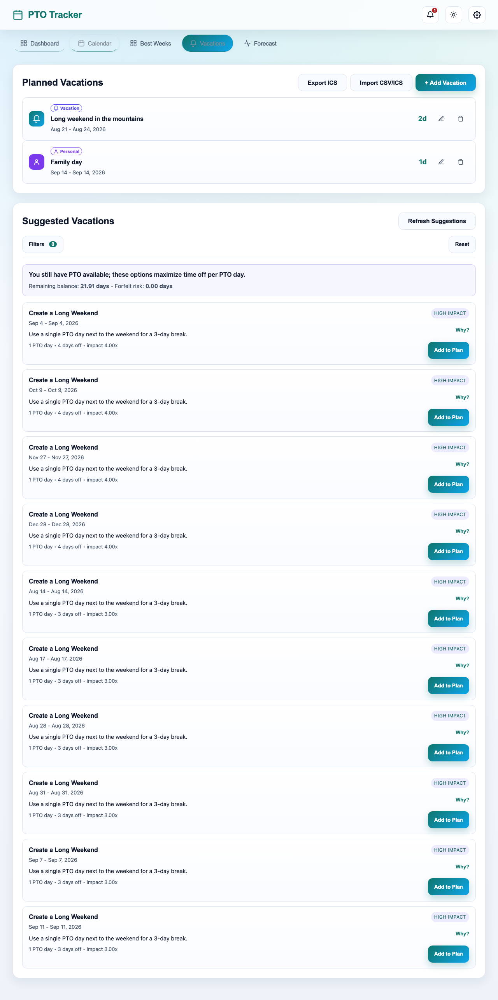
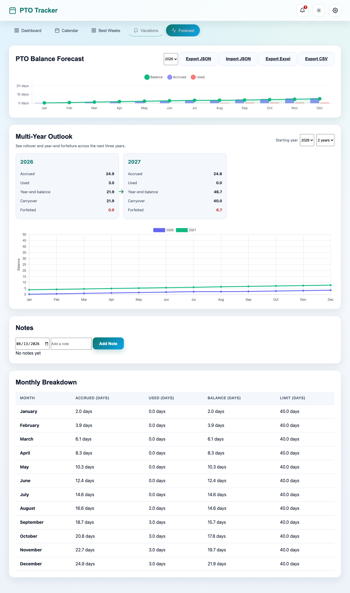
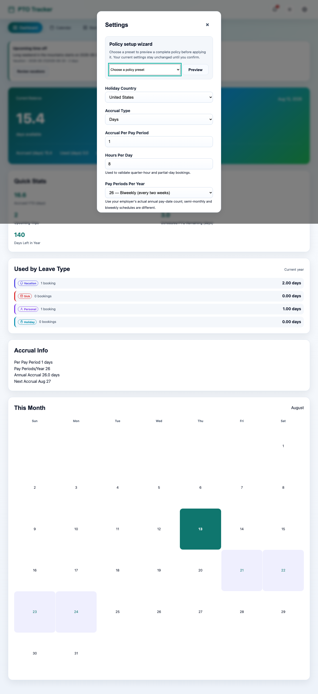
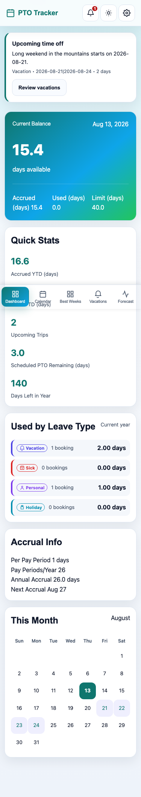

# PTO Tracker

A browser-native PTO calculator, planner, and forecast tool. Your configuration,
vacations, and notes stay in the current browser profile; there are no accounts,
server-side database, sync, or authentication features.

## Features

- Dashboard with PTO balance, accrual, used YTD, and scheduled PTO
- Monthly calendar with holidays and vacation overlays
- Accrual, carryover, vesting, holiday, conflict, forecast, suggestion, and heatmap calculations
- Configurable accrual policy and IANA timezone
- IndexedDB persistence with a localStorage fallback
- Safe soft-delete with undo and retained client-side change history
- Versioned JSON backup/restore plus client-side CSV, ICS, and Excel-compatible exports
- Browser-local CSV/ICS vacation import with validation, duplicate detection, and confirmation preview
- Vacation, sick, personal, and holiday leave types with accessible labels/icons and per-type dashboard totals
- Quarter-hour and partial-day bookings validated against the configured hours per day

## Architecture

Flask is retained as a small static app server for local development and deployment.
The browser loads `static/js/store.js`, a versioned asynchronous storage wrapper, and
`static/js/pto.js`, the pure client-side calculation engine. No user data is sent to
Flask. Storage persistence is requested through the browser Storage API when the app
first loads.

The UI entry point is the native ES module `static/js/app.js`. It coordinates modules
for browser state, DOM-safe rendering, calendar data, vacations, suggestions, forecasts,
and settings without a frontend framework or build step. Renderers construct DOM nodes
and assign user/imported values with `textContent` or safe attributes; intentional SVG
icons are created from fixed element definitions.

Dates are stored and exported as canonical `YYYY-MM-DD` strings. Vacation records include
a normalized leave type plus `days` and quarter-hour `hours`; older records migrate to the
default `vacation` type. The configured IANA timezone controls the browser-local current
date and year boundaries without converting stored date values.

ICS vacation exports use all-day `VALUE=DATE` events and stable UIDs, with leave type and
partial-day metadata in portable `X-PTO-*` properties. Calendar exchange and CSV import
happen entirely in the browser; there is no subscription URL, sync service, authentication,
or external calendar API. JSON backup/restore remains a separate full-data operation.

**Backup note:** browser profile storage is device-specific and can be lost when site
data is cleared or evicted. Use Export JSON regularly, especially before clearing
browser data or changing devices.

## Local Development

### Setup

```bash
python3 -m venv .venv
source .venv/bin/activate
python -m pip install -r requirements.txt
```

`requirements.txt` is the local-development entry point and includes the
Playwright browser-test dependency. The production Docker image installs only
`requirements-prod.txt`; it does not contain test tooling.

### Run the static app

```bash
source .venv/bin/activate
python app.py
```

Open `http://127.0.0.1:5000`. If macOS has port 5000 occupied, run:

```bash
python -c "from app import app; app.run(debug=False, host='127.0.0.1', port=5001)"
```

### Tests

Install Playwright browsers once:

```bash
python -m playwright install
```

Run the client calculation checks:

```bash
node --test tests/client.test.js
```

With the app running at port 5000, run the browser checks:

```bash
python tests/test_app.py
```

To capture review screenshots against another local port, set
`PTO_TEST_BASE_URL` before running `screenshot.py`. Screenshots are generated
under the ignored `screenshots/` directory and are not source artifacts.

## Static hosting

The app is a plain static site: `templates/index.html` (no server-side
templating) plus the `static/` directory. Asset references are relative, so
it works at a domain root or in any subdirectory, for example
`https://example.com/pto-tracker/`:

```bash
cp templates/index.html <webroot>/index.html
cp -R static <webroot>/static/
```

Serve the page from the directory URL (with a trailing slash) so the relative
paths resolve. Any static file server works. Chart.js and the Inter font load
from public CDNs, so visitors need internet access. Optionally set the same
security headers the Flask development server adds (CSP, nosniff, framing);
see `app.py`.

## Docker

```bash
docker compose up --build
```

The Compose service listens on `http://localhost:5000`, runs Gunicorn with two
workers, and serves the same static browser application as the development
server. The image uses a non-root user and installs only the production
dependencies. Stop it with `docker compose down`.

## Using PTO Tracker

### First-run setup

1. Open **Settings** and choose the policy preset that most closely matches
   your employer's PTO policy, or enter the values manually.
2. Confirm the accrual unit (days or hours), hours per day, pay periods per
   year, carryover rules, vesting schedule, holidays, and IANA timezone.
3. Save the policy. The dashboard immediately recalculates the balance,
   accrual forecast, and remaining days.

### Planning time off

- Use **Calendar** to inspect holidays, scheduled leave, and open dates.
- Add vacations from the **Vacations** tab. Date ranges default to business
  days and support fractional days or quarter-hour increments.
- Use **Best Weeks** and **Forecast** to compare suggested booking windows and
  see projected balances through the year.
- Select a leave type (vacation, sick, personal, or holiday) so reports and
  calendar legends remain accurate.

### Backups and exchange

All records stay in the browser. Use the JSON backup action before clearing
site data or moving to another device. CSV and all-day ICS exports are useful
for sharing with other tools; CSV/ICS imports show a validation preview,
identify duplicates, and only write records after confirmation.

## Data and privacy model

PTO Tracker is intentionally server-light: Flask serves the HTML, CSS, and
JavaScript shell, while calculations and persistence happen in the browser.
No account, analytics pipeline, server database, calendar subscription, or
external calendar API is included. Browser storage is profile- and
device-specific, so backups are the user's responsibility. See the in-app
backup note before clearing site data.

## Project layout

```text
app.py                    Flask static server and security headers
templates/index.html      Accessible application shell and dialogs
static/js/store.js        IndexedDB/localStorage persistence layer
static/js/pto.js          Pure PTO calculations and policy logic
static/js/transfer.js     CSV/ICS parsing, validation, and exports
static/js/app.js          Native-module application entry point
static/js/modules/        State, rendering, calendar, forecast, and settings
static/css/style.css      Responsive UI and design tokens
tests/                    Node client tests, Python checks, and Playwright suite
docs/screenshots/         Curated screenshots used in this README
```

## Screenshots and walkthrough

The following images were captured from the current application using the
repository's `screenshot.py` helper with isolated browser data and representative
sample PTO records.

| Dashboard | Calendar |
| --- | --- |
|  |  |

| Vacations | Forecast |
| --- | --- |
|  |  |

| Settings | Mobile layout |
| --- | --- |
|  |  |

For a short end-to-end walkthrough, see the captured [PTO Tracker demo video](docs/pto-tracker-demo.webm).
Regenerate the visual documentation with:

```bash
PTO_TEST_BASE_URL=http://127.0.0.1:5000 \\
PTO_VIDEO_PATH=docs/pto-tracker-demo.webm \\
python screenshot.py
```

## Contributing and license

Bug reports and maintenance improvements are welcome. Keep changes focused on
correctness, accessibility, usability, maintainability, or documentation;
avoid committing browser data, generated logs, or local environment files.
Run the relevant client and browser tests before opening a pull request.

This project is released under the [MIT License](LICENSE).
